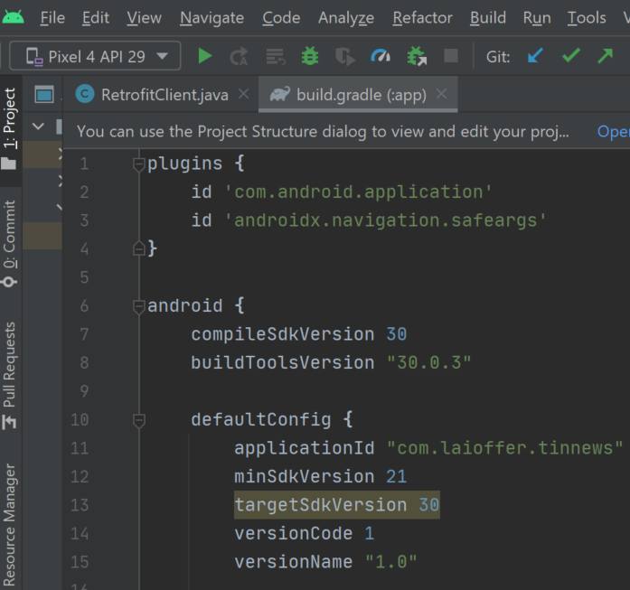
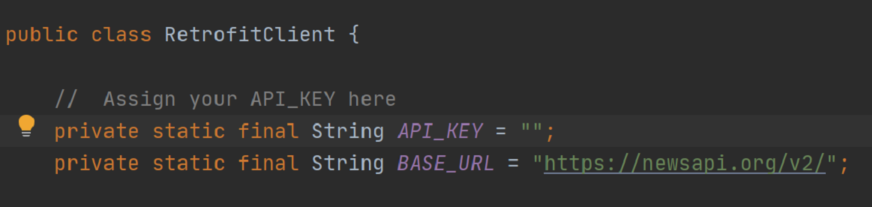
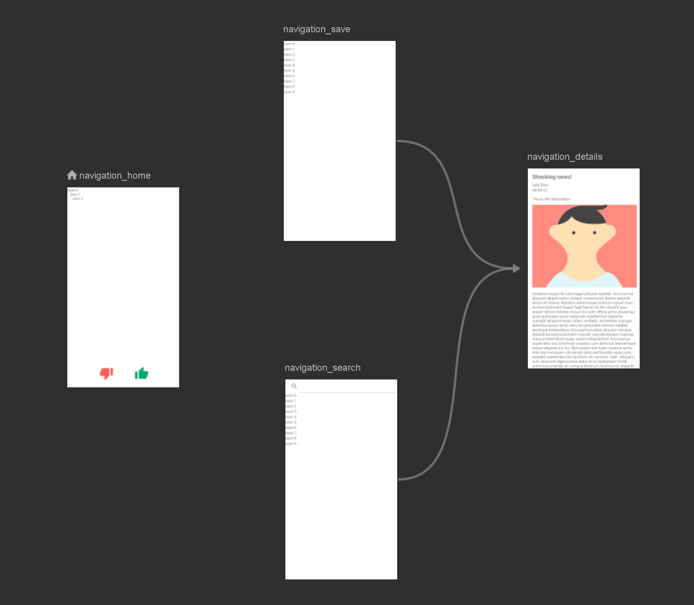
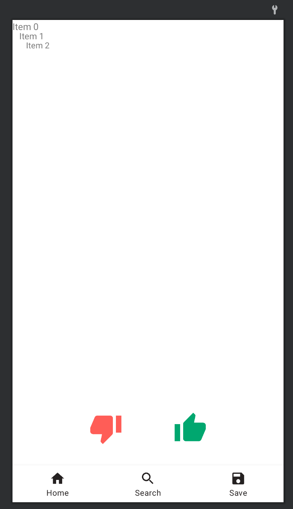
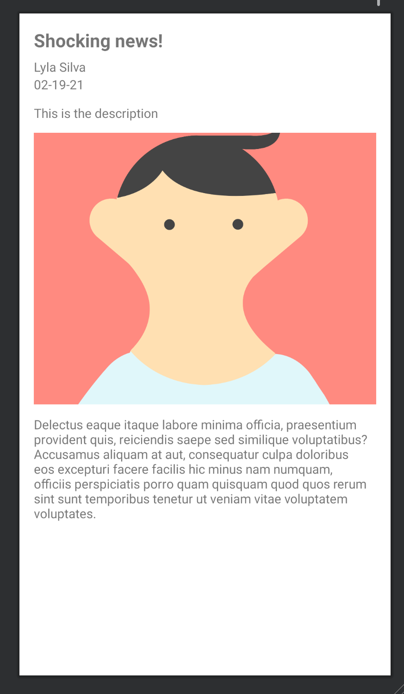
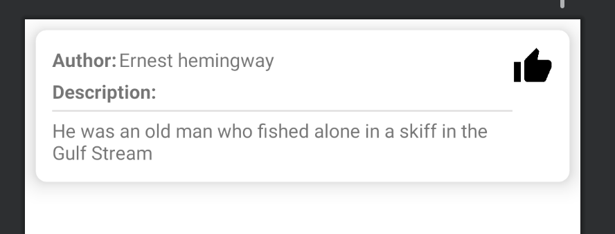

# Like-News-App

<!-- TABLE OF CONTENTS -->
<details open="open">
  <summary><h2 style="display: inline-block">Table of Contents</h2></summary>
  <ol>
    <li>
      <a href="#about-the-project">About The Project</a>
      <ul>
        <li><a href="#built-with">Built With</a></li>
      </ul>
    </li>
    <li>
      <a href="#getting-started">Getting Started</a>
      <ul>
        <li><a href="#prerequisites">Prerequisites</a></li>
        <li><a href="#installation">Installation</a></li>
      </ul>
    </li>
    <li><a href="#usage">Usage</a></li>
    <li><a href="#contact">Contact</a></li>
  </ol>
</details>


<!-- ABOUT THE PROJECT -->
## About The Project


This is an Instagram Flavor News app based on Google Component Architectural MVVM Pattern. It integrated Retrofit and LiveData to pull the latest news data from the newsapi.org endpoint 
<br />
It implemented the bottom bar & page navigation using JetPack navigation component and built the Room Database with LiveData & ViewModel to support the local cache and offline model

### Built With

* [Android](https://www.android.com/)
* [RoomDB](https://developer.android.com/reference/android/arch/persistence/room/RoomDatabase)
* [RecyclerView](https://developer.android.com/guide/topics/ui/layout/recyclerview?gclid=CjwKCAjwmqKJBhAWEiwAMvGt6Kzwlidyn4IJUoru97gltQJakMUNghqFKyGdjASw2XSs2kseG8umDhoCr38QAvD_BwE&gclsrc=aw.ds)


<!-- GETTING STARTED -->
## Getting Started

To get a local copy up and running follow these simple steps.

### Prerequisites

Get a free API from : [newsapi.org](https://newsapi.org/) and store the access key, we will place it in our code
<br/>
  notice: if you want to see the news details, you need to pay for this website~ 

### Installation

1. Clone the repo
   ```sh
   git clone https://github.com/ZLi0111/Like-News-App.git
   ```
2. Install the [Android Studio](https://developer.android.com/studio/?gclid=CjwKCAjwmqKJBhAWEiwAMvGt6OXb0baIE7xg2GTa0by-344TLk0WCvg2tzSMAJXbsjzqb06ao0AblRoC3uEQAvD_BwE&gclsrc=aw.ds), in this app, I choose the complieSdkVersion 30, the buildToolsVersion 30.0.3 and targetSdkVerson 30, to make it work success, make sure you get the right version, or you can change them on the build.gradle
 
3. place the access key you stored before in the RetrofitClient.java files
   


<!-- USAGE EXAMPLES -->
## Usage

There are few deatil code for this app in the res folder
1. First of all, is the navigation, as you can see in the preview, we got 4 pages in this app, the 3 of them are connected, and use navigation to link them together 
2. The home page has 3 news items at first and they are builded by the RecyclerView to handle the card view and swip operations
    for the news card, it look like this 
3. for the save page, it also use the card view to make the consistency 


<!-- CONTACT -->
## Contact

Zhengrong Li - email: Zhengrongli1003@gmail.com

Project Link: [https://github.com/zli0111/Like-News-App](https://github.com/ZLi0111/Like-News-App)

Personal website: [zli0111](http://zli0111.com)

Linkedin: [in/zli0111/](https://www.linkedin.com/in/zli0111/)


